# Pomodoro App (JS) - CI/CD Pipeline

A Pomodoro timer web application with automated CI/CD pipeline using Jenkins, SonarQube, Nexus, and Nginx.

## Table of Contents
- [Pipeline Overview](#pipeline-overview)
- [Pipeline Stages](#pipeline-stages)
- [Architecture](#architecture)
- [E2E Setup Guide](#e2e-setup-guide)
  - [1. Jenkins Master Setup](#1-jenkins-master-setup)
  - [2. Jenkins Agents Setup](#2-jenkins-agents-setup)
  - [3. SonarQube Setup](#3-sonarqube-setup)
  - [4. Nexus Repository Setup](#4-nexus-repository-setup)
  - [5. Nginx Deployment Server Setup](#5-nginx-deployment-server-setup)
  - [6. Jenkins Configuration](#6-jenkins-configuration)
- [Running the Pipeline](#running-the-pipeline)
- [Monitoring](#monitoring)

## Pipeline Overview

The Jenkins pipeline automates the complete software delivery process from code checkout to production deployment:

```
GitHub → Build & Test → Code Quality → Package → Store → Deploy to Nginx
```

## Pipeline Stages

| # | Stage | Agent | Description |
|---|-------|-------|-------------|
| 1 | Checkout Code | sonar | Clone repository from GitHub (`main` branch) |
| 2 | Install Dependencies | sonar | Install npm packages (`npm install`) |
| 3 | SonarQube Analysis | sonar | Static code analysis and quality gates |
| 4 | Run Tests | sonar | Execute test suite (`npm test`) |
| 5 | Build Artifact | sonar | Create production build (`npm run build`) |
| 6 | Package Artifact | sonar | Create versioned tarball (`pomodoro-app-0.0.X.tar.gz`) |
| 7 | Upload to Nexus | sonar | Store artifact in Nexus repository |
| 8 | Deploy to Nginx | tomcat | Download artifact and deploy to web server |

## Architecture

### Infrastructure Components
- **Jenkins Master**: Orchestrates pipeline execution
- **Jenkins Agent (sonar)**: Build, test, and package stages (stages 1-7)
- **Jenkins Agent (tomcat)**: Deployment stage (stage 8)
- **SonarQube Server**: Code quality analysis
- **Nexus Repository**: Artifact storage
- **Nginx Server**: Application deployment target

### Environment Variables (in Jenkinsfile)

```groovy
SONARQUBE_SERVER = 'sonar'
NEXUS_URL = 'http://3.19.221.46:8081'
NEXUS_REPO = 'raw-releases'
NEXUS_GROUP = 'com/web/pomodoro'
NEXUS_ARTIFACT = 'pomodoro-app'
NGINX_SERVER = '18.116.203.32'
NGINX_WEB_ROOT = '/var/www/html'
```

## E2E Setup Guide

### 1. Jenkins Master Setup

#### Install Jenkins on Ubuntu/Debian

```bash
# Install Java
sudo apt update
sudo apt install fontconfig openjdk-21-jre

# Add Jenkins repository
sudo wget -O /etc/apt/keyrings/jenkins-keyring.asc \
  https://pkg.jenkins.io/debian-stable/jenkins.io-2023.key
echo "deb [signed-by=/etc/apt/keyrings/jenkins-keyring.asc]" \
  https://pkg.jenkins.io/debian-stable binary/ | sudo tee \
  /etc/apt/sources.list.d/jenkins.list > /dev/null


# Install Jenkins
sudo apt update
sudo apt install jenkins -y

# Start Jenkins
sudo systemctl start jenkins
sudo systemctl enable jenkins

# Get initial admin password
sudo cat /var/lib/jenkins/secrets/initialAdminPassword
```

#### Initial Jenkins Configuration

1. Access Jenkins: `http://<jenkins-server-ip>:8080`
2. Use initial admin password to unlock
3. Install suggested plugins
4. Create admin user
5. Configure Jenkins URL


#### Install Required Plugins

```
Manage Jenkins → Plugins → Available plugins
```

Install these plugins:
- Git
- Pipeline
- Credentials Binding
- SSH Agent
- NodeJS Plugin
- SonarQube Scanner


After installation, configure NodeJS:
```
Manage Jenkins → Tools → NodeJS installations
- Name: NodeJS-LTS
- Install automatically: ✓
- Version: Latest LTS (20.x)
```

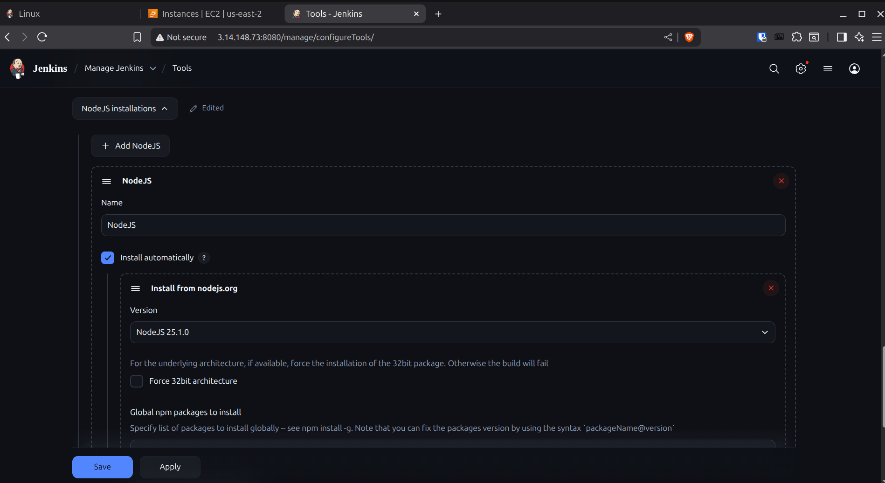

### 2. Jenkins Agents Setup

#### Agent 1: `sonar` (Build Agent)

**On Agent Machine:**

```bash
# Install Java
sudo apt update
sudo apt install openjdk-17-jdk -y

# Install Node.js
curl -fsSL https://deb.nodesource.com/setup_20.x | sudo -E bash -
sudo apt install -y nodejs

# Install required tools
sudo apt install git curl tar -y

# Create Jenkins user
sudo useradd -m -s /bin/bash jenkins

# Create workspace directory
sudo mkdir -p /home/jenkins/workspace
sudo chown -R jenkins:jenkins /home/jenkins

# Generate SSH key for Jenkins master (run on Jenkins master)
ssh-keygen -t rsa -b 4096 -f ~/.ssh/jenkins_sonar_key -N ""

# Copy public key to agent (run on Jenkins master)
ssh-copy-id -i ~/.ssh/jenkins_sonar_key.pub jenkins@<sonar-agent-ip>
```

**In Jenkins (Master):**

```
Manage Jenkins → Nodes → New Node
- Node name: sonar
- Type: Permanent Agent
- # of executors: 2
- Remote root directory: /home/jenkins
- Labels: sonar
- Usage: Use this node as much as possible
- Launch method: Launch agents via SSH
  - Host: <sonar-agent-ip>
  - Credentials: Add → SSH Username with private key
    - ID: jenkins-sonar-ssh
    - Username: jenkins
    - Private Key: Enter directly (paste content of ~/.ssh/jenkins_sonar_key)
  - Host Key Verification Strategy: Non verifying Verification Strategy
- Availability: Keep this agent online as much as possible
```

#### Agent 2: `tomcat` (Deployment Agent)

**On Agent Machine:**

```bash
# Install Java
sudo apt update
sudo apt install openjdk-17-jdk -y

# Install required tools
sudo apt install curl tar -y

# Create Jenkins user
sudo useradd -m -s /bin/bash jenkins

# Create workspace directory
sudo mkdir -p /home/jenkins/workspace
sudo chown -R jenkins:jenkins /home/jenkins

# Grant sudo permissions for deployment
echo "jenkins ALL=(ALL) NOPASSWD: /bin/mkdir, /bin/rm, /bin/tar, /bin/chown" | sudo tee /etc/sudoers.d/jenkins
sudo chmod 0440 /etc/sudoers.d/jenkins

# Generate SSH key for Jenkins master (run on Jenkins master)
ssh-keygen -t rsa -b 4096 -f ~/.ssh/jenkins_tomcat_key -N ""

# Copy public key to agent (run on Jenkins master)
ssh-copy-id -i ~/.ssh/jenkins_tomcat_key.pub jenkins@<tomcat-agent-ip>
```

**In Jenkins (Master):**

```
Manage Jenkins → Nodes → New Node
- Node name: tomcat
- Type: Permanent Agent
- # of executors: 1
- Remote root directory: /home/jenkins
- Labels: tomcat
- Usage: Only build jobs with label expressions matching this node
- Launch method: Launch agents via SSH
  - Host: <tomcat-agent-ip>
  - Credentials: Add → SSH Username with private key
    - ID: jenkins-tomcat-ssh
    - Username: jenkins
    - Private Key: Enter directly (paste content of ~/.ssh/jenkins_tomcat_key)
  - Host Key Verification Strategy: Non verifying Verification Strategy
```


### 3. SonarQube Setup


Run this script with permissions to setup sonarqube

```bash
#!/bin/bash
set -e

# Update system
apt-get update
apt-get upgrade -y

# Install Java 17
apt-get install -y openjdk-17-jdk
java -version

# Create sonarqube system user
useradd -m -s /bin/bash sonarqube || true

# Create directories
mkdir -p /opt/sonarqube
mkdir -p /var/sonarqube-data
chown -R sonarqube:sonarqube /opt/sonarqube
chown -R sonarqube:sonarqube /var/sonarqube-data

# Download and install SonarQube
cd /tmp
wget https://binaries.sonarsource.com/Distribution/sonarqube/sonarqube-10.6.0.92116.zip
apt-get install -y unzip
unzip sonarqube-10.6.0.92116.zip
mv sonarqube-10.6.0.92116 /opt/sonarqube/sonarqube
rm sonarqube-10.6.0.92116.zip

chown -R sonarqube:sonarqube /opt/sonarqube

# Configure SonarQube properties (embedded H2 database)
cat > /opt/sonarqube/sonarqube/conf/sonar.properties <<EOF
sonar.web.host=0.0.0.0
sonar.web.port=9000
sonar.path.data=/var/sonarqube-data/data
sonar.path.logs=/var/sonarqube-data/logs
sonar.path.temp=/var/sonarqube-data/temp
EOF

# Increase system limits for SonarQube
echo "sonarqube - nofile 65536" >> /etc/security/limits.conf
echo "sonarqube - nproc 4096" >> /etc/security/limits.conf

# Set kernel parameters for Elasticsearch
sysctl -w vm.max_map_count=524288
echo "vm.max_map_count=524288" >> /etc/sysctl.conf

# Create systemd service
cat > /etc/systemd/system/sonarqube.service <<EOF
[Unit]
Description=SonarQube
After=network.target

[Service]
Type=forking
ExecStart=/opt/sonarqube/sonarqube/bin/linux-x86-64/sonar.sh start
ExecStop=/opt/sonarqube/sonarqube/bin/linux-x86-64/sonar.sh stop
User=sonarqube
Group=sonarqube
Restart=on-failure

[Install]
WantedBy=multi-user.target
EOF

# Enable and start SonarQube
systemctl daemon-reload
systemctl enable sonarqube
systemctl start sonarqube >> /var/log/sonarqube-startup.log 2>&1

echo "SonarQube is starting. Access it at http://<EC2-IP>:9000 in 2-3 minutes"
echo "Default credentials: admin / admin"
echo "View logs: tail -f /var/log/sonarqube-startup.log"
echo "Service logs: sudo journalctl -u sonarqube -f"
```

**Generate SonarQube Token:**

1. Access SonarQube: `http://<sonarqube-ip>:9000`
2. Default credentials: admin/admin (change on first login)
3. Navigate to: My Account → Security → Generate Token
4. Token name: `jenkins`
5. Copy the generated token


**Configure in Jenkins:**

```
Manage Jenkins → System → SonarQube servers
- Name: sonar
- Server URL: http://<sonarqube-ip>:9000
- Server authentication token: Add → Secret text
  - Secret: <paste sonarqube token>
  - ID: sonar-token
  - Description: SonarQube Token
```


### 4. Nexus Repository Setup

```bash
# Install Java
sudo apt update
sudo apt install openjdk-11-jdk -y

# Download and install Nexus
cd /opt
sudo wget https://download.sonatype.com/nexus/3/latest-unix.tar.gz
sudo tar -xzf latest-unix.tar.gz
sudo mv nexus-3.* nexus

# Create Nexus user
sudo useradd -r -s /bin/bash nexus
sudo chown -R nexus:nexus /opt/nexus
sudo chown -R nexus:nexus /opt/sonatype-work

# Configure Nexus to run as nexus user
echo "run_as_user=\"nexus\"" | sudo tee /opt/nexus/bin/nexus.rc

# Create systemd service
sudo tee /etc/systemd/system/nexus.service << EOF
[Unit]
Description=Nexus Repository Manager
After=network.target

[Service]
Type=forking
LimitNOFILE=65536
ExecStart=/opt/nexus/bin/nexus start
ExecStop=/opt/nexus/bin/nexus stop
User=nexus
Restart=on-abort

[Install]
WantedBy=multi-user.target
EOF

# Start Nexus
sudo systemctl daemon-reload
sudo systemctl start nexus
sudo systemctl enable nexus

# Get initial admin password (after Nexus starts - takes ~2 minutes)
sudo cat /opt/sonatype-work/nexus3/admin.password
```


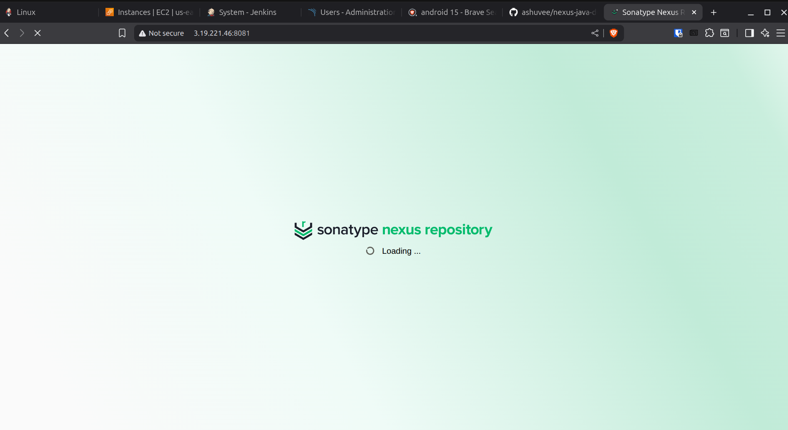

**Configure Nexus:**

1. Access Nexus: `http://<nexus-ip>:8081`
2. Login with admin and initial password
3. Complete setup wizard, set new admin password
4. Create raw-releases repository:
   ```
   Settings (gear icon) → Repositories → Create repository
   - Recipe: raw (hosted)
   - Name: raw-releases
   - Version policy: Release
   - Deployment policy: Allow redeploy
   - Blob store: default
   ```

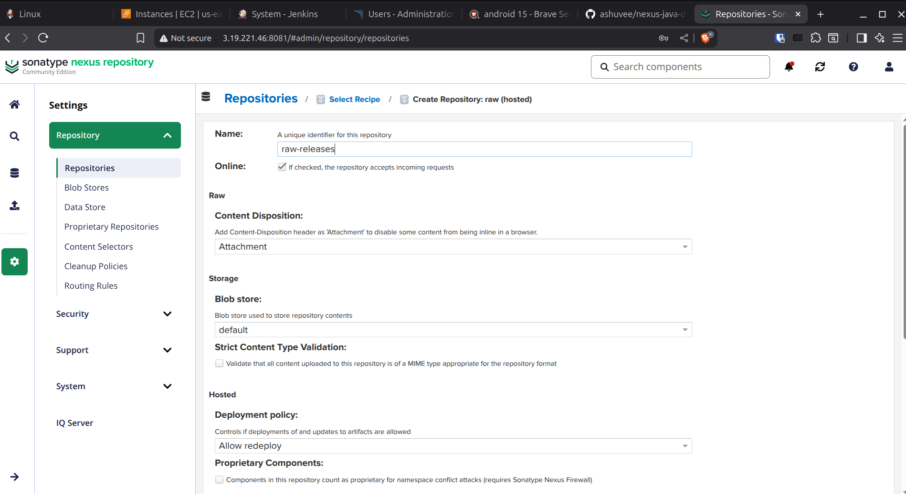


**Add Nexus Credentials to Jenkins:**

```
Manage Jenkins → Credentials → System → Global credentials → Add Credentials
- Kind: Username with password
- Scope: Global
- Username: admin
- Password: <nexus-password>
- ID: nexus
- Description: Nexus Repository Credentials
```

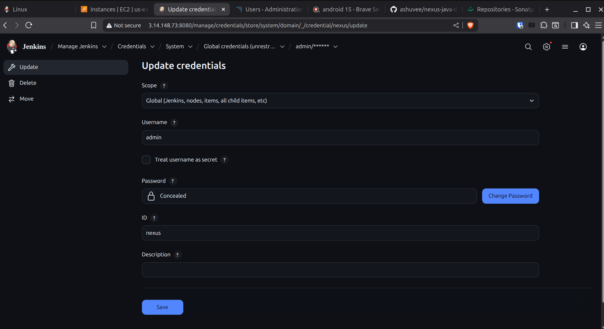

### 5. Nginx Deployment Server Setup

```bash
# Install Nginx
sudo apt update
sudo apt install nginx -y

# Test and restart Nginx
sudo nginx -t
sudo systemctl restart nginx
sudo systemctl enable nginx

# Configure firewall
sudo ufw allow 'Nginx Full'
```


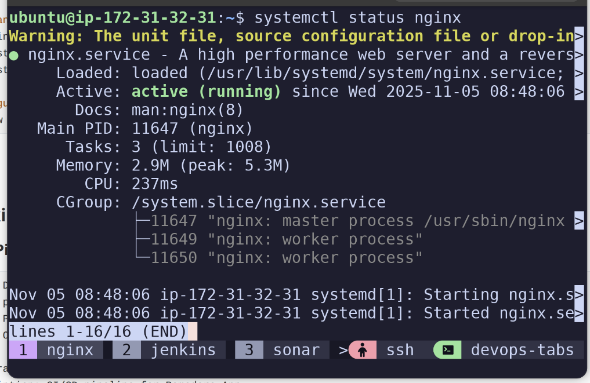

### 6. Jenkins Configuration

#### Create Pipeline Job

```
Jenkins Dashboard → New Item
- Name: pomodoro-js
- Type: Pipeline
- Click OK

Configuration:
- Description: CI/CD pipeline for Pomodoro App
- Discard old builds: ✓
  - Strategy: Log Rotation
  - Max # of builds to keep: 10

Pipeline:
- Definition: Pipeline script from SCM
- SCM: Git
  - Repository URL: https://github.com/ashuvee/pomodoro-app-js.git
  - Branch Specifier: */main
  - Credentials: (leave empty for public repo)
- Script Path: Jenkinsfile

Build Triggers (optional):
- GitHub hook trigger for GITScm polling: ✓ (if webhook configured)
- Poll SCM: H/5 * * * * (check every 5 minutes)

Save
```


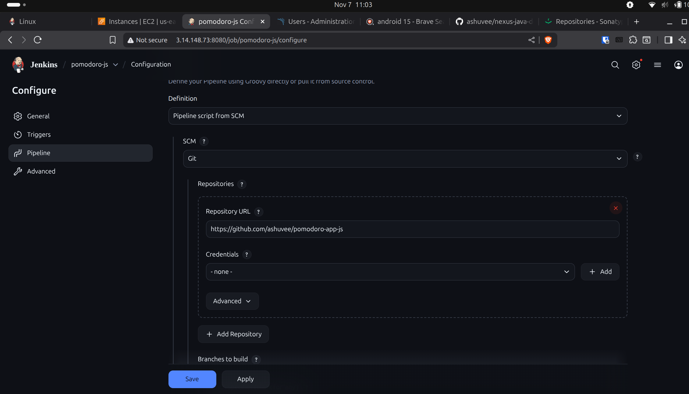

#### Setup GitHub Webhook (for automatic builds)

```
GitHub Repository → Settings → Webhooks → Add webhook
- Payload URL: http://<jenkins-url>:8080/github-webhook/
- Content type: application/json
- Which events: Just the push event
- Active: ✓
```


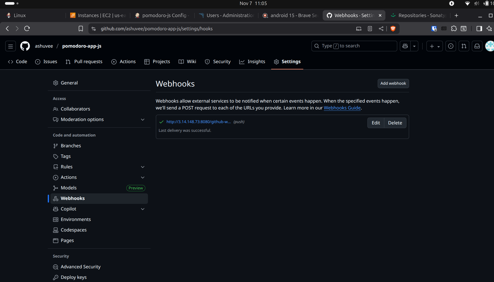

## Running the Pipeline

### Manual Trigger
```
Jenkins → pomodoro-app-pipeline → Build Now
```

### Automatic Trigger (GitHub Webhook)
```
GitHub Repo → Settings → Webhooks → Add webhook
Payload URL: http://<jenkins-url>/github-webhook/
Content type: application/json
Events: Just the push event
```

## Versioning

Artifacts are versioned using Jenkins build number:
```
Format: 0.0.${BUILD_NUMBER}
Example: 0.0.42
```

## Artifact Structure

```
Nexus Storage Path:
http://3.19.221.46:8081/repository/raw-releases/
  └── com/web/pomodoro/pomodoro-app/
      └── 0.0.X/
          └── pomodoro-app-0.0.X.tar.gz

Tarball Contents:
- index.html
- assets/
  ├── *.js
  ├── *.css
  └── images/
```

## Deployment

Application is deployed to: **http://18.116.203.32/**


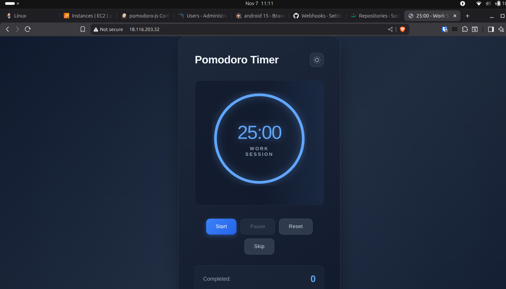

### Verification
```bash
# Check deployment
curl http://18.116.203.32/

# View Nginx logs
sudo tail -f /var/log/nginx/access.log
sudo tail -f /var/log/nginx/error.log

# Verify files
ls -la /var/www/html/
```


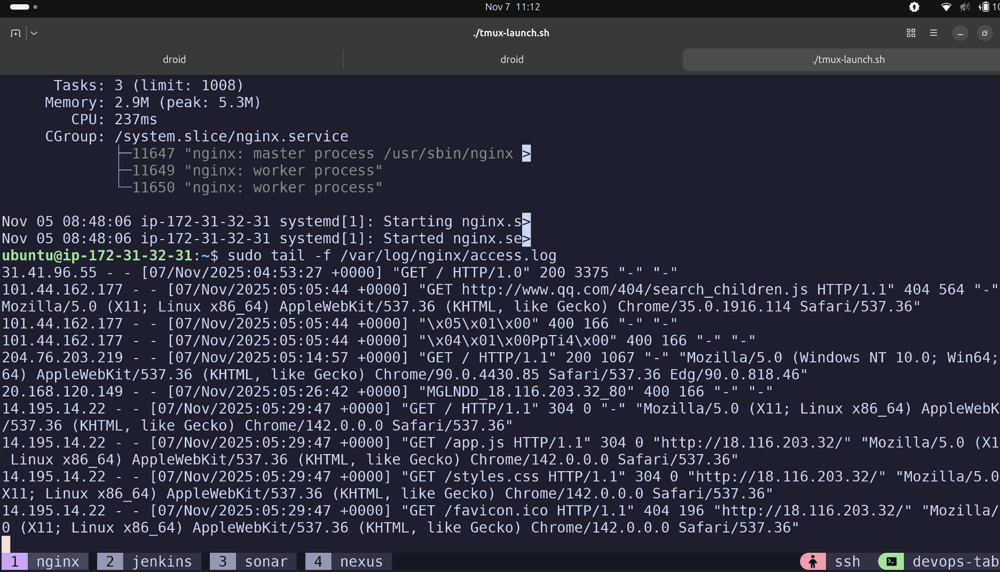

## Monitoring

### Jenkins Console
- View build logs: `Job → Build #X → Console Output`
- Stage view: Visual pipeline progress
- Build history: Success/failure trends

### SonarQube Dashboard
- Code quality metrics
- Code coverage
- Security vulnerabilities
- Code smells and bugs

### Nexus Repository
- Browse artifacts: `Browse → raw-releases → com/web/pomodoro`
- Version history
- Download previous versions

## Pipeline Flow Diagram

```
┌──────────────┐
│   GitHub     │
│   (main)     │
└──────┬───────┘
       │
       ▼
┌──────────────────────────────────┐
│     Jenkins Pipeline             │
│     Agent: sonar                 │
├──────────────────────────────────┤
│ 1. Checkout Code                 │
│ 2. npm install                   │
│ 3. SonarQube Analysis            │
│ 4. npm test                      │
│ 5. npm run build → dist/         │
│ 6. tar → pomodoro-app-0.0.X.tgz  │
│ 7. Upload to Nexus               │
└──────────────┬───────────────────┘
               │
               ▼
┌──────────────────────────────────┐
│   Nexus Repository               │
│   raw-releases/com/web/pomodoro  │
└──────────────┬───────────────────┘
               │
               ▼
┌──────────────────────────────────┐
│     Jenkins Pipeline             │
│     Agent: tomcat                │
├──────────────────────────────────┤
│ 8. Download from Nexus           │
│    Extract to /var/www/html/     │
│    Set permissions               │
└──────────────┬───────────────────┘
               │
               ▼
┌──────────────────────────────────┐
│   Nginx Web Server               │
│   http://18.116.203.32/          │
└──────────────────────────────────┘
```

### Jenkins Pipeline Success

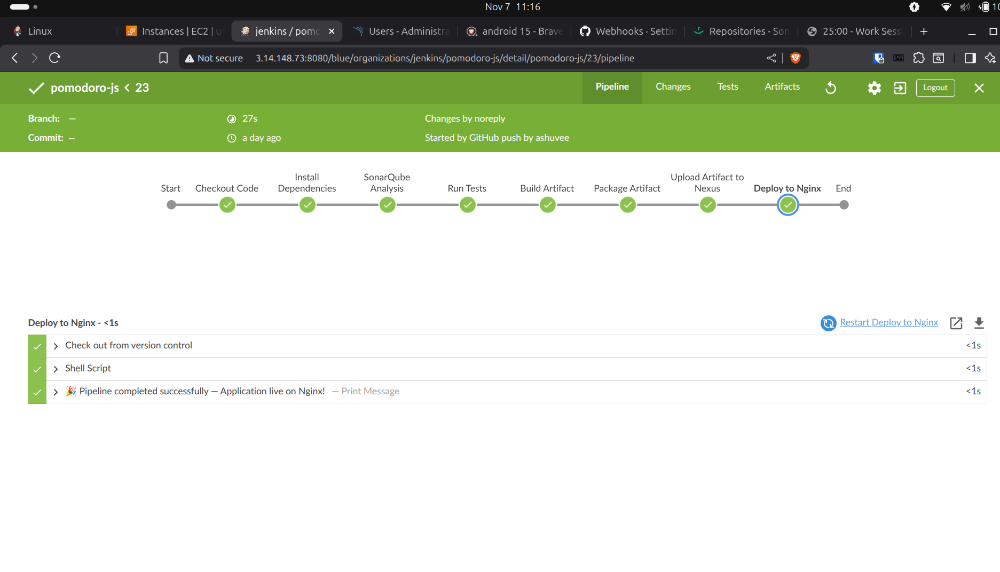


### SonarQube Dashboard 


### Nexus Repository Browser 

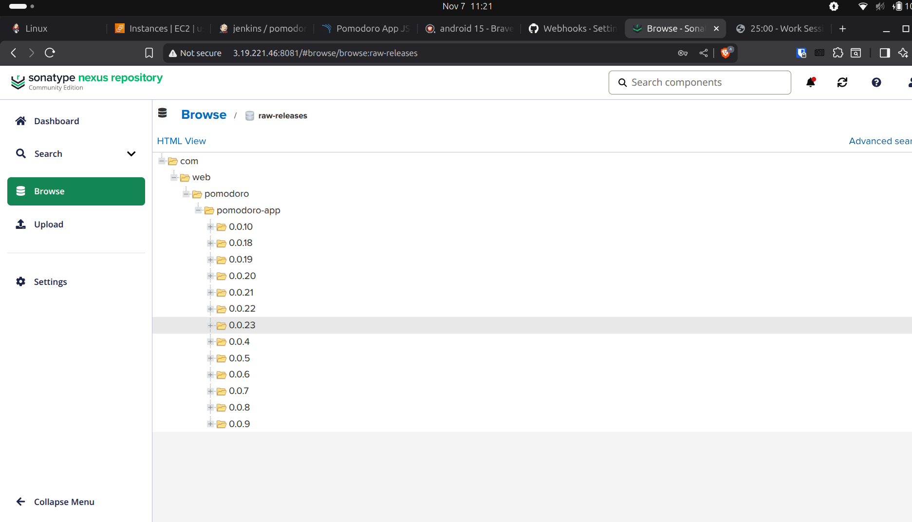

### Jenkins Nodes/Agents

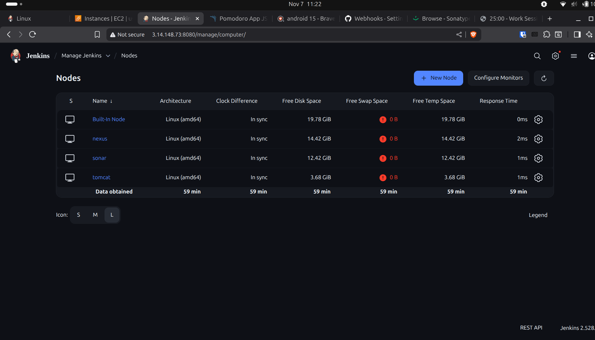

### Jenkins Console Output 


